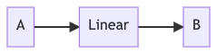
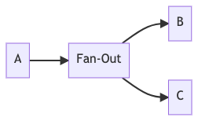
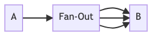
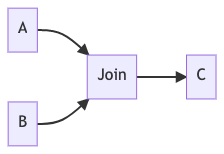
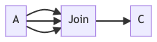
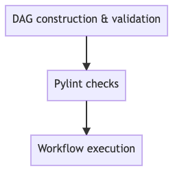
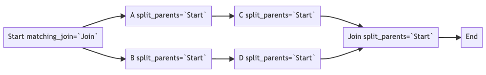
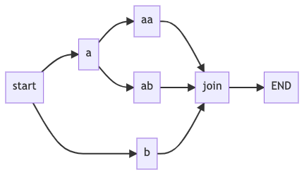
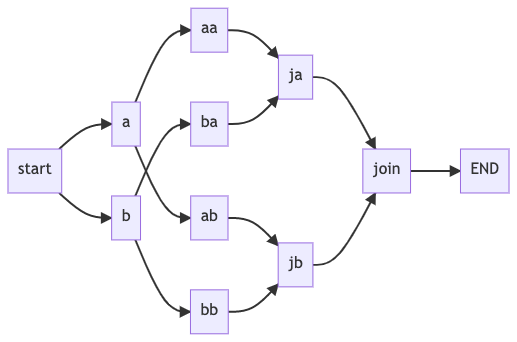

# Metaflow Deep Dive (1) - Static Analysis


## Introduction

[Metaflow](https://metaflow.org/) is an open-source Python framework developed by Netflix for building fast and scalable
data science and ML workflows. It offers a concise set of intuitive yet powerful APIs, enabling users to focus on
expressing their workflow topology.

If you are new to Metaflow, here are some excellent [tutorials](https://docs.metaflow.org/getting-started/install) to
get started.


### Why I Wrote This

Lately I joined Netflix to work on Metaflow, about which I'm keen on learning everything. Since I do not have much
exposure to aspects such as functional and meta programming in Python, it is a rewarding learning experience digesting
the source code.

In this series of articles, I'll be walking through major implementation details of Metaflow. These writings will serve
as my notes as well as (hopefully) reference for you.

## Entering the Playground

### Environment Setup

- Python: 3.9
- Metaflow: 2.4.7
- OS: macOS Monterey 12.0.1

With an editor/IDE that comes with handy code navigation and debugger support, you can easily follow along with my
progress in this series.

### A Sample Workflow

Let's start with a simple workflow, namely `branch_flow.py`:

```python
from metaflow import FlowSpec, step


class BranchFlow(FlowSpec):

    @step
    def start(self):
        self.next(self.a, self.b)

    @step
    def a(self):
        self.x = 1
        self.next(self.join)

    @step
    def b(self):
        self.x = 2
        self.next(self.join)

    @step
    def join(self, inputs):
        print('a is %s' % inputs.a.x)
        print('b is %s' % inputs.b.x)
        print('total is %d' % sum(input.x for input in inputs))
        self.next(self.end)

    @step
    def end(self):
        pass


if __name__ == '__main__':
    BranchFlow()
```

A couple of things to note here:

* User-defined workflow class (`BranchFlow`) inherits from `FlowSpec`.
* Each step/stage of the workflow should be a method decorated with `@step`. A valid workflow begins with `start` and
  finishes at `end`.
* The `self.next` function is invoked exactly once at the end of each step to specify the next step (_transition_) to
  execute. The entire workflow is logically built into a _directed acyclic graph (DAG)_.


### Types of a Step

A `step` belongs to one of the following types:

#### Linear

A `linear` step contains one parent step and one child step.



#### Fan-Out

A `fan-out` step has one parent step but two or more child steps, or one child step to be executed multiple times.

- Static fan-out connects to multiple hard-coded child steps.



- Foreach/parallel fan-out has one child step that is executed multiple times, where the repetition is known at runtime.



#### Join (Fan-In)

A `join` step has `fan-out` parent step(s) and one child step. The child step is executed once all the parent steps are
completed. It is the step to process the gathered results from parent fan-out steps.

- Join from static fan-out.



- Join from foreach/parallel fan-out.



### The `@step` Decorator

Before we move on, let's just inspect the `@step` decorator:

```python
# metaflow/decorators.py

def step(f):
    """
    The step decorator. Makes a method a step in the workflow.
    """
    f.is_step = True
    f.decorators = []
    try:
        # python 3
        f.name = f.__name__
    except:
        # python 2
        f.name = f.__func__.func_name
    return f
```

It simply marks a method as a `step` by adding an attribute `is_step` to it, so that Metaflow can recognize it later by
checking the presence of that attribute.

### Lifecycle of a Metaflow Run

By running the code of `BranchFlow` example with `python3 branch_flow.py run`, following output (or similar) can be
observed:

```text
Metaflow 2.4.7 executing BranchFlow for user:lizhaoliu
Validating your flow...
    The graph looks good!
Running pylint...
    Pylint is happy!
2021-12-29 09:24:11.264 Workflow starting (run-id 1640798651260512):
2021-12-29 09:24:11.269 [1640798651260512/start/1 (pid 47309)] Task is starting.
2021-12-29 09:24:11.793 [1640798651260512/start/1 (pid 47309)] Task finished successfully.
2021-12-29 09:24:11.796 [1640798651260512/a/2 (pid 47312)] Task is starting.
2021-12-29 09:24:11.798 [1640798651260512/b/3 (pid 47313)] Task is starting.
2021-12-29 09:24:12.428 [1640798651260512/b/3 (pid 47313)] Task finished successfully.
2021-12-29 09:24:12.442 [1640798651260512/a/2 (pid 47312)] Task finished successfully.
2021-12-29 09:24:12.445 [1640798651260512/join/4 (pid 47318)] Task is starting.
2021-12-29 09:24:12.900 [1640798651260512/join/4 (pid 47318)] a is 1
2021-12-29 09:24:12.900 [1640798651260512/join/4 (pid 47318)] b is 2
2021-12-29 09:24:12.954 [1640798651260512/join/4 (pid 47318)] total is 3
2021-12-29 09:24:12.955 [1640798651260512/join/4 (pid 47318)] Task finished successfully.
2021-12-29 09:24:12.958 [1640798651260512/end/5 (pid 47321)] Task is starting.
2021-12-29 09:24:13.428 [1640798651260512/end/5 (pid 47321)] Task finished successfully.
2021-12-29 09:24:13.428 Done!
```

We can see that Metaflow did the following things sequentially:



A more detailed workflow lifecyle diagram can be
found [here](https://github.com/lizhaoliu/metaflow/blob/master/docs/lifecycle.png) in Metaflow docs archive.

### Entry Point

A user-defined workflow class is supposed to inherit from `FlowSpec`.

```python
# metaflow/flowspec.py

class FlowSpec(object):
    def __init__(self, use_cli=True):
        """
        Construct a FlowSpec

        Parameters
        ----------
        use_cli : bool, optional, default: True
            Set to True if the flow is invoked from __main__ or the command line
        """

        self.name = self.__class__.__name__

        self._datastore = None
        self._transition = None
        self._cached_input = {}

        self._graph = FlowGraph(self.__class__)
        self._steps = [getattr(self, node.name) for node in self._graph]

        if use_cli:
            # we import cli here to make sure custom parameters in
            # args.py get fully evaluated before cli.py is imported.
            from . import cli
            cli.main(self)
```

1. `self._graph = FlowGraph(self.__class__)` constructs a workflow DAG.
2. `cli.main(self)` starts the workflow.

Now before diving into the execution part, let's look into the `FlowGraph` class.

### FlowGraph

`FlowGraph` is the class that represents a workflow DAG. It also provides with methods to statically inspect the graph.

```python
# metaflow/graph.py

class FlowGraph(object):
    def __init__(self, flow_class):
        self.name = flow_class.__name__
        self.nodes = self._create_nodes(flow_class)
        self.doc = deindent_docstring(flow_class.__doc__)
        self._traverse_graph()
        self._postprocess()
```

The constructor takes a workflow class as an argument, and it does the following things:

1. `self._create_nodes(flow_class)` creates graph nodes and edges based on steps defined in the workflow.
2. `self._traverse_graph()` traverses the graph to gather additional information (parents, fan-out, etc.).
3. `self._postprocess()` does remaining postprocessing.

#### Node Creation

DAG nodes are created by `_create_nodes` function. It inspects the workflow class source code, creates a graph topology
out of it, and returns a dictionary of DAG nodes. Internally it relies on `ast`
module ([_Abstract Syntax Tree - AST_](https://en.wikipedia.org/wiki/Abstract_syntax_tree)) that parses the code into a
tree representation.

```python
# metaflow/graph.py

class FlowGraph(object):
    def _create_nodes(self, flow_class) -> dict[str, DAGNode]:
        module = __import__(flow_class.__module__)
        tree = ast.parse(inspect.getsource(module)).body
        root = [n for n in tree if isinstance(n, ast.ClassDef) and n.name == self.name][
            0
        ]
        nodes = {}
        StepVisitor(nodes, flow_class).visit(root)
        return nodes
```

1. Metaflow fetches source code of the workflow module, then `ast` module is used to parse the code and builds an AST.
2. The workflow class AST root is retrieved by matching type `ast.ClassDef` and the name of the workflow class.
3. A `StepVisitor` object traverses the workflow class AST and populates the dictionary of `{method_name -> DAGNode}`.
   Each step's metadata is encapsulated by a `DAGNode` object.

```python
# metaflow/graph.py

class StepVisitor(ast.NodeVisitor):
    def __init__(self, nodes, flow):
        self.nodes = nodes
        self.flow = flow
        super(StepVisitor, self).__init__()

    def visit_FunctionDef(self, node):
        func = getattr(self.flow, node.name)
        if hasattr(func, "is_step"):
            self.nodes[node.name] = DAGNode(node, func.decorators, func.__doc__)
```

#### (Optional) More on AST

If you are interested in knowing more about AST, you can read about
it [here](https://greentreesnakes.readthedocs.io/en/latest/index.html),
and [here](https://docs.python.org/3/library/ast.html).

#### Building a `DAGNode`

As mentioned earlier, a `DAGNode` instance encapsulates the metadata of a `step`.

```python
# metaflow/graph.py

# some fields are omitted in the constructor here.
class DAGNode(object):
    def __init__(self, func_ast, decos, doc):
        # these attributes are populated by _parse
        self.type = None  # Type of this step.
        self.out_funcs = []  # Outbound/child step(s) (called in self.next).
        self.num_args = 0  # Number of arguments, including `self`.
        self._parse(func_ast)  # Parses the function AST and updates the metadata.

        # these attributes are populated by _traverse_graph
        self.in_funcs = set()  # Inbound/parent step(s).
        self.split_parents = []  # Parent steps that have started unclosed fan-out till current step.
        self.matching_join = None  # The join (fan-in) step down the graph that matches current split (fan-out).
```

1. It initializes a bunch of graph metadata fields.
2. `self._parse(func_ast)` is invoked for determining the step `type` and `out_funcs` (child steps).

```python
# metaflow/graph.py

class DAGNode(object):
    def _parse(self, func_ast):
        self.num_args = len(func_ast.args.args)
        tail = func_ast.body[-1]

        # end doesn't need a transition
        if self.name == "end":
            # TYPE: end
            self.type = "end"

        # ensure that the tail an expression (a call of `self.next` is expected)
        if not isinstance(tail, ast.Expr):
            return

        # determine the type of self.next transition
        try:
            if not self._expr_str(tail.value.func) == "self.next":
                return

            self.has_tail_next = True
            self.invalid_tail_next = True
            self.tail_next_lineno = tail.lineno
            self.out_funcs = [e.attr for e in tail.value.args]

            # Keyword arguments in `self.next` call.
            next_kwargs = dict(
                (k.arg, getattr(k.value, "s", None)) for k in tail.value.keywords
            )
            if len(next_kwargs) == 1:
                if "foreach" in next_kwargs:
                    # TYPE: foreach
                    self.type = "foreach"
                    if len(self.out_funcs) == 1:
                        self.foreach_param = next_kwargs["foreach"]
                        self.invalid_tail_next = False
                elif "num_parallel" in next_kwargs:
                    self.type = "foreach"
                    self.parallel_foreach = True
                    if len(self.out_funcs) == 1:
                        self.invalid_tail_next = False
                elif "condition" in next_kwargs:
                    # TYPE: split-or
                    self.type = "split-or"
                    if len(self.out_funcs) == 2:
                        self.condition = next_kwargs["condition"]
                        self.invalid_tail_next = False
            elif len(next_kwargs) == 0:
                if len(self.out_funcs) > 1:
                    # TYPE: split-and
                    self.type = "split-and"
                    self.invalid_tail_next = False
                elif len(self.out_funcs) == 1:
                    # TYPE: linear
                    if self.num_args > 1:
                        self.type = "join"
                    else:
                        self.type = "linear"
                    self.invalid_tail_next = False
        except AttributeError:
            return
```

Key takeaways from `_parse(..)`:

1. The last statement in a `step` must call `self.next` (except for `end` step).
2. At most one keyword argument is allowed in a `self.next` call.
3. A `step` is one of these types (internally):
    - `linear`: single step in `self.next` call. This step must take no arguments except for `self`.
    - `join`: single step in `self.next` call. Must have at least one argument as inputs.
    - `split-and`: two or more steps in `self.next` call, _all of which_ are executed.
    - `split-or`: exactly two steps in `self.next` call, _one of which_ is executed, determined by the `condition`
      keyword argument.
    - `foreach` (`num_parallel`): single step in `self.next` call. The number of executions is dictated by the data size
      from `foreach` (`num_parallel`) keyword argument.
4. `split-and`, `split-or` and `foreach` are _fan-out_, whereas `join` is _fan-in_.

#### Graph Traversal

Now that a DAG is successfully built, Metaflow traverses it to update other essential fields.

```python
# metaflow/graph.py

class FlowGraph(object):
    def _traverse_graph(self):
        def traverse(node, seen, split_parents):
            if node.type in ("split-or", "split-and", "foreach"):
                node.split_parents = split_parents
                split_parents = split_parents + [node.name]
            elif node.type == "join":
                # ignore joins without splits
                if split_parents:
                    self[split_parents[-1]].matching_join = node.name
                    node.split_parents = split_parents
                    split_parents = split_parents[:-1]
            else:
                node.split_parents = split_parents

            for n in node.out_funcs:
                # graph may contain loops - ignore them
                if n not in seen:
                    # graph may contain unknown transitions - ignore them
                    if n in self:
                        child = self[n]
                        child.in_funcs.add(node.name)
                        traverse(child, seen + [n], split_parents)

        if "start" in self:
            traverse(self["start"], [], [])

        # fix the order of in_funcs
        for node in self.nodes.values():
            node.in_funcs = sorted(node.in_funcs)
```

The traversal is performed in a _Depth First Search (DFS)_ fashion, beginning from the `start` step.

There are a few fields that are updated each time when a node/step is visited:

- `node.in_funcs`: parent steps, as opposed to `node.out_funcs` which are child steps.
- `node.split_parents`: a list of upstream fan-out steps where each starts an unclosed (at this step) fan-out. If a step
  has at least one `split_parents` then it is inside an unclosed fan-out.
- `node.matching_join`: the downstream `join` step that closes the fan-out started by this step.



#### Graph Postprocess

The postprocessing marks if a node is inside an ongoing `foreach` fan-out.

```python
# metaflow/graph.py

class FlowGraph(object):
    def _postprocess(self):
        # any node who has a foreach as any of its split parents
        # has is_inside_foreach=True *unless* all of those foreaches
        # are joined by the node
        for node in self.nodes.values():
            foreaches = [
                p for p in node.split_parents if self.nodes[p].type == "foreach"
            ]
            if [f for f in foreaches if self.nodes[f].matching_join != node.name]:
                node.is_inside_foreach = True
```

### Lint Checks

The `lint` module (`metaflow/lint.py`) contains a set of validity checks that are run against a DAG. From these checks
we can see all the rules Metaflow enforces. Should any of the checks fail, Metaflow raises an exception and tells you
what and where the error is.

There are 15 checks in total, summarized below:

* `check_reserved_words`: step name cannot be a reserved word {`name`, `next`, `input`, `index`, `cmd`}.
* `check_basic_steps`: graph must have `start` and `end` steps.
* `check_that_end_is_end`: `end` step must be the last step in the graph, and it must have no inputs.
* `check_step_names`: step name must be matching regex `[a-z0-9_]+`, and first character must not be `_`.
* `check_num_args`:
    * A step must have one (`self`) or two arguments.
    * Only a `join` step can have two arguments (`self` and another as inputs).
* `check_static_transitions`: non-end steps must call `self.next` at tail.
* `check_valid_transitions`: steps must have valid `self.next` calls.
* `check_unknown_transitions`: transitions must be within the steps defined in the graph.
* `check_for_acyclicity`: DAG must not contain cycles.
* `check_for_orphans`: all steps must be reachable from `start`.
* `check_split_join_balance`:
    * All fan-out steps must be joined before `end` is reached.
    * Any `join` step's parents must all have the _same_ fan-out step. The following graphs are illegal:





* `check_empty_foreaches`: there must be at least one step between a `foreach` fan-out step and a `join` step.
* `check_parallel_step_after_next`: child steps of a `parallel` fan-out step must all be `parallel`.
* `check_parallel_foreach_calls_parallel_step`:  a step with `@parallel` decorator must be called by a `parallel` step.
* `check_nested_foreach`: nested `foreach` fan-outs are not allowed.

## Closing Thoughts

It is a pleasure to open the hood of Metaflow, though there are a few things that I do not fully understand at this
moment.

1. A `join` step is determined by having more than one argument (in `DAGNode._parse` method) besides `self`, not by the
   number of parent steps it has. For example, if a step has multiple parent steps, but only `self` as an argument, then
   it is NOT a `join`.
2. I don't see the reason why a `join` step's parents must all have the _same_ fan-out step. My guess is that it is
   easier to synchronize the execution and data/or flow. This will be revisited in the future.

That would be all for this post! Hopefully you have enjoyed reading. In next post, I will discuss the details of
workflow execution.
