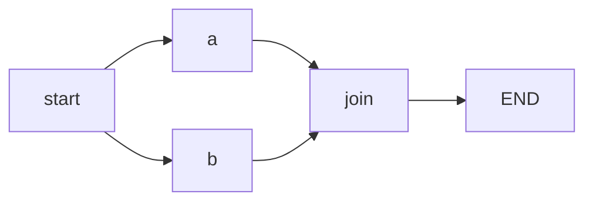
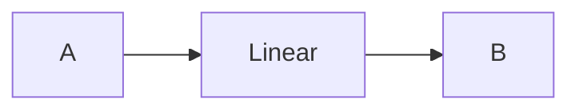
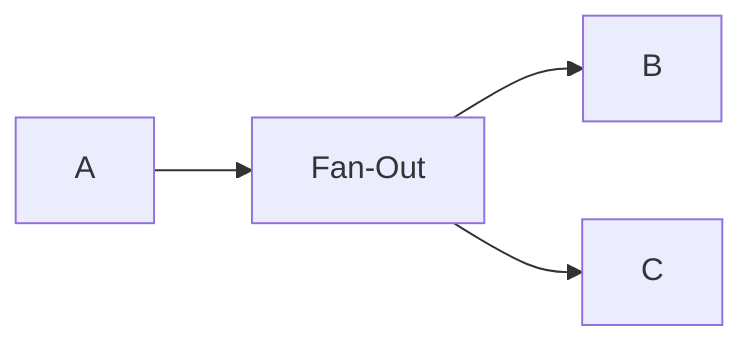
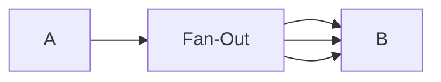
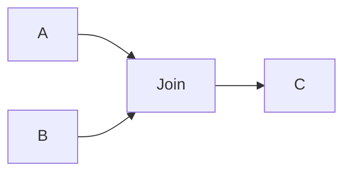
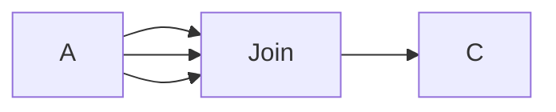
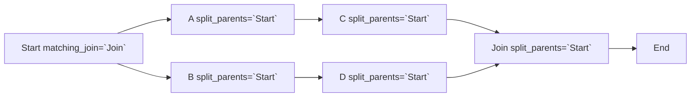
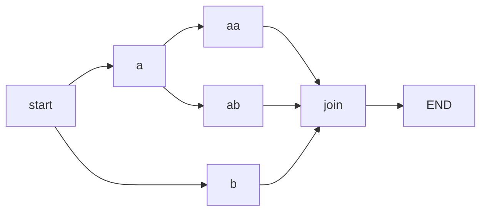
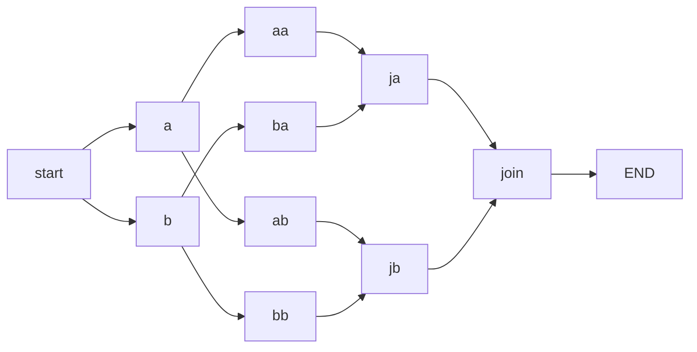

# Metaflow Deep Dive (1)

## Introduction

[Metaflow](https://metaflow.org/) is a popular open-source Python framework for building fast and scalable data science
workflows, originally developed within Netflix. It is quite intuitive to use, and is designed to be used in a
semi-declarative way.

If you are new to Metaflow, here are some well written [tutorials](https://docs.metaflow.org/getting-started/install) to
get started.

### Why I Wrote This

Metaflow codebase is not a colossus, and it's a rewarding learning experience parsing the source code without being
drowned. In this series of articles, I'll be focusing on walking through implementation details of Metaflow, instead of
on the general idea of how to use it. Note that I may add/remove comments in the original source code to help with the
guidance.

There can (probably will) be mistakes in my writing, and what you see here may be outdated at some point.

## Entering the Playground

### Environment Setup

- Python: 3.9
- Metaflow: 2.4.7
- OS: macOS Monterey 12.0.1

### A Sample Workflow

Starting with a simple workflow:

```python
from metaflow import FlowSpec, step


class BranchFlow(FlowSpec):

    @step
    def start(self):
        self.next(self.a, self.b)

    @step
    def a(self):
        self.x = 1
        self.next(self.join)

    @step
    def b(self):
        self.x = 2
        self.next(self.join)

    @step
    def join(self, inputs):
        print('a is %s' % inputs.a.x)
        print('b is %s' % inputs.b.x)
        print('total is %d' % sum(input.x for input in inputs))
        self.next(self.end)

    @step
    def end(self):
        pass


if __name__ == '__main__':
    BranchFlow()
```

* The user-defined workflow class inherits from `FlowSpec`.
* Each method in `BranchFlow` that is decorated with `@step` is a step/stage in the workflow. In Metaflow world, a flow
  should always begin with `start` and finishes at `end`.
* The `self.next` function is invoked exactly once at the end of each step to specify the next step (_transition_). The
  entire workflow is logically structured as a _directed acyclic graph (DAG)_, and it is executed accordingly.



### Role of a Step

Conceptually, a `step` wears one of three hats:

#### Linear

A `linear` step has exactly one parent step and one child step.



#### Fan-Out

A `fan-out` step has one parent step but two or more child steps, or one child step to be executed multiple times.

- Branched fan-out, child steps are predefined in the workflow.



- Foreach/parallel fan-out, where the number of child steps is not known in advance.



#### Join (Fan-In)

A `join` step has `fan-out` parent step(s) and one child step, the child step is executed once all the parent steps are
completed.

- Join from branched fan-out.



- Join from foreach/parallel fan-out.



### Things that Metaflow Does for You

By running the code above, following output can be observed:

```text
Metaflow 2.4.7 executing BranchFlow for user:lizhaoliu
Validating your flow...
    The graph looks good!
Running pylint...
    Pylint is happy!
2021-12-29 09:24:11.264 Workflow starting (run-id 1640798651260512):
2021-12-29 09:24:11.269 [1640798651260512/start/1 (pid 47309)] Task is starting.
2021-12-29 09:24:11.793 [1640798651260512/start/1 (pid 47309)] Task finished successfully.
2021-12-29 09:24:11.796 [1640798651260512/a/2 (pid 47312)] Task is starting.
2021-12-29 09:24:11.798 [1640798651260512/b/3 (pid 47313)] Task is starting.
2021-12-29 09:24:12.428 [1640798651260512/b/3 (pid 47313)] Task finished successfully.
2021-12-29 09:24:12.442 [1640798651260512/a/2 (pid 47312)] Task finished successfully.
2021-12-29 09:24:12.445 [1640798651260512/join/4 (pid 47318)] Task is starting.
2021-12-29 09:24:12.900 [1640798651260512/join/4 (pid 47318)] a is 1
2021-12-29 09:24:12.900 [1640798651260512/join/4 (pid 47318)] b is 2
2021-12-29 09:24:12.954 [1640798651260512/join/4 (pid 47318)] total is 3
2021-12-29 09:24:12.955 [1640798651260512/join/4 (pid 47318)] Task finished successfully.
2021-12-29 09:24:12.958 [1640798651260512/end/5 (pid 47321)] Task is starting.
2021-12-29 09:24:13.428 [1640798651260512/end/5 (pid 47321)] Task finished successfully.
2021-12-29 09:24:13.428 Done!
```

From the log, we see that Metaflow has done the following:

1. Graph (DAG) validation.
2. Pylint checks.
3. Executing the workflow.

The `workflow` has a _unique ID_, and each of the `step` method is executed _by a separate process_
in the logical order they are defined in the code. For now, we can keep that in mind, and I will get back to it in the
next a few posts.

### A Step

Before we go right in, let's look at the `@step` decorator in `metaflow/decorators.py`:

```python
def step(f: Callable) -> Callable:
    """
    The step decorator. Makes a method a step in the workflow.
    """
    f.is_step = True
    f.decorators = []
    try:
        # python 3
        f.name = f.__name__
    except:
        # python 2
        f.name = f.__func__.func_name
    return f
```

Pretty straightforward. It marks a method as a step in the workflow simply by adding an attribute `is_step` to it, then
later Metaflow recognizes it by checking the presence of that attribute.

### Main Entry Point

Our workflow class inherits from `FlowSpec`, and it kicks off running right after the initializer is called. Now jumping
into the `FlowSpec` class (some fields and comments are omitted for brevity) definition in `metaflow/flowspec.py`:

```python
class FlowSpec(object):
    def __init__(self, use_cli=True):
        """
        Construct a FlowSpec

        Parameters
        ----------
        use_cli : bool, optional, default: True
            Set to True if the flow is invoked from __main__ or the command line
        """

        self.name = self.__class__.__name__

        self._datastore = None
        self._transition = None
        self._cached_input = {}

        self._graph = FlowGraph(self.__class__)
        self._steps = [getattr(self, node.name) for node in self._graph]

        if use_cli:
            # we import cli here to make sure custom parameters in
            # args.py get fully evaluated before cli.py is imported.
            from . import cli

            cli.main(self)
```

As you would've guessed, a DAG is constructed by `self._graph = FlowGraph(self.__class__)`. Then `cli.main(self)` is
called to start running the workflow. Next up let's look into the `FlowGraph` class.

### FlowGraph

`FlowGraph` is the class that represents a directed acyclic graph (DAG). The source code is `metaflow/graph.py`. Its
constructor is displayed below:

```python
class FlowGraph(object):
    def __init__(self, flow_class):
        self.name = flow_class.__name__
        self.nodes = self._create_nodes(flow_class)
        self.doc = deindent_docstring(flow_class.__doc__)
        self._traverse_graph()
        self._postprocess()
```

It has our custom workflow class as an argument, and then it does the following things:

1. Creates graph nodes and edges based on the steps defined in the workflow - `self._create_nodes(flow_class)`.
2. Traverses the graph to build additional metadata - `self._traverse_graph()`.
3. Some postprocessing work - `self._postprocess()`.

#### Node Creation

First, DAG nodes are created by `_create_nodes`. It takes in the workflow class as an argument, and returns a list of
nodes. Have you wondered how Metaflow inspects the workflow class and creates a graph topology out of it? Well, it
relies on the `ast` module (short for _Abstract Syntax Tree - AST_) for that part, which we will observe below:

```python
def _create_nodes(self, flow_class) -> dict[str, DAGNode]:
    module = __import__(flow_class.__module__)
    tree = ast.parse(inspect.getsource(module)).body
    root = [n for n in tree if isinstance(n, ast.ClassDef) and n.name == self.name][
        0
    ]
    nodes = {}
    StepVisitor(nodes, flow_class).visit(root)
    return nodes
```

1. Metaflow fetches source code of the module where the workflow is defined, then it utilizes `ast` module to parse the
   that source code to build a module-level AST.
2. The workflow class AST root is located by matching the type `ast.ClassDef` and the name of the workflow class.
3. The `StepVisitor` class is used to traverse the AST and populates the dictionary of `{method_name -> DAGNode}`
   for each step (remember `@step` decorator adds `is_step` attribute to each step). Each step's metadata is wrapped
   into a `DAGNode` object.

```python
class StepVisitor(ast.NodeVisitor):
    def __init__(self, nodes, flow):
        self.nodes = nodes
        self.flow = flow
        super(StepVisitor, self).__init__()

    def visit_FunctionDef(self, node):
        func = getattr(self.flow, node.name)
        if hasattr(func, "is_step"):
            self.nodes[node.name] = DAGNode(node, func.decorators, func.__doc__)
```

#### (Optional) Inspecting the AST

If you are unfamiliar with AST, you can read about
it [here](https://greentreesnakes.readthedocs.io/en/latest/index.html),
and [here](https://docs.python.org/3/library/ast.html).

Curious of what `BranchFlow` module AST is like? You can parse it and make sense of it yourself below:
<details>
<summary>Click to show AST</summary>

```text
Module(
  body=[
    ImportFrom(
      module='metaflow',
      names=[
        alias(name='FlowSpec', asname=None),
        alias(name='step', asname=None),
      ],
      level=0,
    ),
    ClassDef(
      name='BranchFlow',
      bases=[Name(id='FlowSpec', ctx=Load())],
      keywords=[],
      body=[
        FunctionDef(
          name='start',
          args=arguments(
            posonlyargs=[],
            args=[arg(arg='self', annotation=None, type_comment=None)],
            vararg=None,
            kwonlyargs=[],
            kw_defaults=[],
            kwarg=None,
            defaults=[],
          ),
          body=[
            Expr(
              value=Call(
                func=Attribute(
                  value=Name(id='self', ctx=Load()),
                  attr='next',
                  ctx=Load(),
                ),
                args=[
                  Attribute(
                    value=Name(id='self', ctx=Load()),
                    attr='a',
                    ctx=Load(),
                  ),
                  Attribute(
                    value=Name(id='self', ctx=Load()),
                    attr='b',
                    ctx=Load(),
                  ),
                ],
                keywords=[],
              ),
            ),
          ],
          decorator_list=[Name(id='step', ctx=Load())],
          returns=None,
          type_comment=None,
        ),
        FunctionDef(
          name='a',
          args=arguments(
            posonlyargs=[],
            args=[arg(arg='self', annotation=None, type_comment=None)],
            vararg=None,
            kwonlyargs=[],
            kw_defaults=[],
            kwarg=None,
            defaults=[],
          ),
          body=[
            Assign(
              targets=[
                Attribute(
                  value=Name(id='self', ctx=Load()),
                  attr='x',
                  ctx=Store(),
                ),
              ],
              value=Constant(value=1, kind=None),
              type_comment=None,
            ),
            Expr(
              value=Call(
                func=Attribute(
                  value=Name(id='self', ctx=Load()),
                  attr='next',
                  ctx=Load(),
                ),
                args=[
                  Attribute(
                    value=Name(id='self', ctx=Load()),
                    attr='join',
                    ctx=Load(),
                  ),
                ],
                keywords=[],
              ),
            ),
          ],
          decorator_list=[Name(id='step', ctx=Load())],
          returns=None,
          type_comment=None,
        ),
        FunctionDef(
          name='b',
          args=arguments(
            posonlyargs=[],
            args=[arg(arg='self', annotation=None, type_comment=None)],
            vararg=None,
            kwonlyargs=[],
            kw_defaults=[],
            kwarg=None,
            defaults=[],
          ),
          body=[
            Assign(
              targets=[
                Attribute(
                  value=Name(id='self', ctx=Load()),
                  attr='x',
                  ctx=Store(),
                ),
              ],
              value=Constant(value=2, kind=None),
              type_comment=None,
            ),
            Expr(
              value=Call(
                func=Attribute(
                  value=Name(id='self', ctx=Load()),
                  attr='next',
                  ctx=Load(),
                ),
                args=[
                  Attribute(
                    value=Name(id='self', ctx=Load()),
                    attr='join',
                    ctx=Load(),
                  ),
                ],
                keywords=[],
              ),
            ),
          ],
          decorator_list=[Name(id='step', ctx=Load())],
          returns=None,
          type_comment=None,
        ),
        FunctionDef(
          name='join',
          args=arguments(
            posonlyargs=[],
            args=[
              arg(arg='self', annotation=None, type_comment=None),
              arg(arg='inputs', annotation=None, type_comment=None),
            ],
            vararg=None,
            kwonlyargs=[],
            kw_defaults=[],
            kwarg=None,
            defaults=[],
          ),
          body=[
            Expr(
              value=Call(
                func=Name(id='print', ctx=Load()),
                args=[
                  BinOp(
                    left=Constant(value='a is %s', kind=None),
                    op=Mod(),
                    right=Attribute(
                      value=Attribute(
                        value=Name(id='inputs', ctx=Load()),
                        attr='a',
                        ctx=Load(),
                      ),
                      attr='x',
                      ctx=Load(),
                    ),
                  ),
                ],
                keywords=[],
              ),
            ),
            Expr(
              value=Call(
                func=Name(id='print', ctx=Load()),
                args=[
                  BinOp(
                    left=Constant(value='b is %s', kind=None),
                    op=Mod(),
                    right=Attribute(
                      value=Attribute(
                        value=Name(id='inputs', ctx=Load()),
                        attr='b',
                        ctx=Load(),
                      ),
                      attr='x',
                      ctx=Load(),
                    ),
                  ),
                ],
                keywords=[],
              ),
            ),
            Expr(
              value=Call(
                func=Name(id='print', ctx=Load()),
                args=[
                  BinOp(
                    left=Constant(value='total is %d', kind=None),
                    op=Mod(),
                    right=Call(
                      func=Name(id='sum', ctx=Load()),
                      args=[
                        GeneratorExp(
                          elt=Attribute(
                            value=Name(id='input', ctx=Load()),
                            attr='x',
                            ctx=Load(),
                          ),
                          generators=[
                            comprehension(
                              target=Name(id='input', ctx=Store()),
                              iter=Name(id='inputs', ctx=Load()),
                              ifs=[],
                              is_async=0,
                            ),
                          ],
                        ),
                      ],
                      keywords=[],
                    ),
                  ),
                ],
                keywords=[],
              ),
            ),
            Expr(
              value=Call(
                func=Attribute(
                  value=Name(id='self', ctx=Load()),
                  attr='next',
                  ctx=Load(),
                ),
                args=[
                  Attribute(
                    value=Name(id='self', ctx=Load()),
                    attr='end',
                    ctx=Load(),
                  ),
                ],
                keywords=[],
              ),
            ),
          ],
          decorator_list=[Name(id='step', ctx=Load())],
          returns=None,
          type_comment=None,
        ),
        FunctionDef(
          name='end',
          args=arguments(
            posonlyargs=[],
            args=[arg(arg='self', annotation=None, type_comment=None)],
            vararg=None,
            kwonlyargs=[],
            kw_defaults=[],
            kwarg=None,
            defaults=[],
          ),
          body=[Pass()],
          decorator_list=[Name(id='step', ctx=Load())],
          returns=None,
          type_comment=None,
        ),
      ],
      decorator_list=[],
    ),
    If(
      test=Compare(
        left=Name(id='__name__', ctx=Load()),
        ops=[Eq()],
        comparators=[Constant(value='__main__', kind=None)],
      ),
      body=[
        Expr(
          value=Call(
            func=Name(id='BranchFlow', ctx=Load()),
            args=[],
            keywords=[],
          ),
        ),
      ],
      orelse=[],
    ),
  ],
  type_ignores=[],
)
```

</details>

#### Building a `DAGNode`

As mentioned earlier, a `DAGNode` instance encapsulates the metadata of a step. Here is a list of essential fields for
building the graph (some fields are omitted).

```python
class DAGNode(object):
    def __init__(self, func_ast, decos, doc):
        # these attributes are populated by _parse
        self.type = None  # Type of this step.
        self.out_funcs = []  # Outbound/child step(s) (called in self.next).
        self.num_args = 0  # Number of arguments, including `self`.
        self._parse(func_ast)  # Parses the function AST and captures the metadata.

        # these attributes are populated by _traverse_graph
        self.in_funcs = set()  # Inbound/parent step(s).
        self.split_parents = []  # Parent steps that have started unclosed fan-out till current step.
        self.matching_join = None  # The join (fan-in) step down the graph that matches current split (fan-out).
```

Jumping into `_parse` method, which is responsible for determining the `type` and `out_funcs` (child steps)
.

```python
def _parse(self, func_ast):
    self.num_args = len(func_ast.args.args)
    tail = func_ast.body[-1]

    # end doesn't need a transition
    if self.name == "end":
        # TYPE: end
        self.type = "end"

    # ensure that the tail an expression (a call of `self.next` is expected)
    if not isinstance(tail, ast.Expr):
        return

    # determine the type of self.next transition
    try:
        if not self._expr_str(tail.value.func) == "self.next":
            return

        self.has_tail_next = True
        self.invalid_tail_next = True
        self.tail_next_lineno = tail.lineno
        self.out_funcs = [e.attr for e in tail.value.args]

        # Keyword arguments in `self.next` call.
        next_kwargs = dict(
            (k.arg, getattr(k.value, "s", None)) for k in tail.value.keywords
        )
        if len(next_kwargs) == 1:
            if "foreach" in next_kwargs:
                # TYPE: foreach
                self.type = "foreach"
                if len(self.out_funcs) == 1:
                    self.foreach_param = next_kwargs["foreach"]
                    self.invalid_tail_next = False
            elif "num_parallel" in next_kwargs:
                self.type = "foreach"
                self.parallel_foreach = True
                if len(self.out_funcs) == 1:
                    self.invalid_tail_next = False
            elif "condition" in next_kwargs:
                # TYPE: split-or
                self.type = "split-or"
                if len(self.out_funcs) == 2:
                    self.condition = next_kwargs["condition"]
                    self.invalid_tail_next = False
        elif len(next_kwargs) == 0:
            if len(self.out_funcs) > 1:
                # TYPE: split-and
                self.type = "split-and"
                self.invalid_tail_next = False
            elif len(self.out_funcs) == 1:
                # TYPE: linear
                if self.num_args > 1:
                    self.type = "join"
                else:
                    self.type = "linear"
                self.invalid_tail_next = False
    except AttributeError:
        return
```

Some key takeaways from the above code:

1. The last statement in a valid step should be a call of `self.next` (except for _end_ step).
2. `self.next` call must have at most one keyword argument.
3. A step can be one of these types:
    - `linear`: single step in `self.next` call. This step must take no arguments except for `self`.
    - `split-and`: two or more steps in `self.next` call, _all of which_ are executed.
    - `split-or`: exactly two steps in `self.next` call, _one of which_ is executed, determined by the `condition`
      keyword argument.
    - `foreach` (`num_parallel`): single step in `self.next` call. The number of executions is dictated by the data size
      from `foreach` (`num_parallel`) keyword argument.
    - `join`: single step in `self.next` call. Must have at least one argument as inputs (from parent steps).
4. `split-and`, `split-or` and `foreach` are for _fan-out_, whereas `join` is for _fan-in_.

#### Graph Traversal

Now that the DAG topology is constructed, Metaflow traverses the graph to update other crucial fields.

```python
def _traverse_graph(self):
    def traverse(node, seen, split_parents):
        if node.type in ("split-or", "split-and", "foreach"):
            node.split_parents = split_parents
            split_parents = split_parents + [node.name]
        elif node.type == "join":
            # ignore joins without splits
            if split_parents:
                self[split_parents[-1]].matching_join = node.name
                node.split_parents = split_parents
                split_parents = split_parents[:-1]
        else:
            node.split_parents = split_parents

        for n in node.out_funcs:
            # graph may contain loops - ignore them
            if n not in seen:
                # graph may contain unknown transitions - ignore them
                if n in self:
                    child = self[n]
                    child.in_funcs.add(node.name)
                    traverse(child, seen + [n], split_parents)

    if "start" in self:
        traverse(self["start"], [], [])

    # fix the order of in_funcs
    for node in self.nodes.values():
        node.in_funcs = sorted(node.in_funcs)
```

The traversal is performed in a Depth First Search (DFS) routine, beginning from the _start_ step. There are a few
fields that are updated along the way when each node is visited:

- `node.in_funcs`: names of the parent steps, as opposed to `node.out_funcs` which are the child steps.
- `node.split_parents`: a list of parent steps that started unclosed fan-out till current step. If a step has at least
  one `split_parents` then it is inside an unclosed fan-out.
- `node.matching_join`: name of the join/fan-in step down the graph that closes current fan-out.



#### Graph Postprocess

The postprocessing step simply examines if each node is inside an unclosed `foreach` fan-out.

```python
def _postprocess(self):
    # any node who has a foreach as any of its split parents
    # has is_inside_foreach=True *unless* all of those foreaches
    # are joined by the node
    for node in self.nodes.values():
        foreaches = [
            p for p in node.split_parents if self.nodes[p].type == "foreach"
        ]
        if [f for f in foreaches if self.nodes[f].matching_join != node.name]:
            node.is_inside_foreach = True
```

### Lint Checks

The `lint` module (`metaflow/lint.py`) contains a set of validity checks that are run on a DAG. From these checks we can
see all the prerequisites Metaflow enforces. Should any of the checks fail, Metaflow raises an exception and tells you
what and where the error is.

There are 15 checks in total, summarized below:

* `check_reserved_words`: step name cannot be a reserved word {`name`, `next`, `input`, `index`, `cmd`}.
* `check_basic_steps`: graph must have `start` and `end` steps.
* `check_that_end_is_end`: `end` step must be the last step in the graph, and it must have no inputs.
* `check_step_names`: step name must be matching regex `[a-z0-9_]+`, and first character must not be `_`.
* `check_num_args`:
    * A step must have one (`self`) or two arguments.
    * Only a `join` step can have two arguments (`self` and another as inputs).
* `check_static_transitions`: non-end steps must call `self.next` at tail.
* `check_valid_transitions`: steps must have valid `self.next` calls.
* `check_unknown_transitions`: transitions must be within the steps defined in the graph.
* `check_for_acyclicity`: DAG must not contain cycles.
* `check_for_orphans`: all steps must be reachable from `start`.
* `check_split_join_balance`:
    * All fan-out steps must be joined before `end` is reached.
    * Any `join` step's parents must all have the _same_ fan-out step. The following graphs are illegal:





* `check_empty_foreaches`: there must be at least one step between a `foreach` step and a `join` step.
* `check_parallel_step_after_next`:
* `check_parallel_foreach_calls_parallel_step`:
* `check_nested_foreach`: